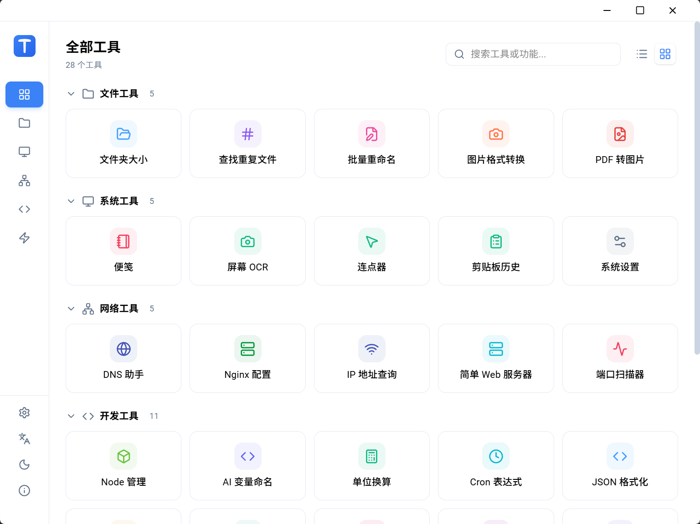
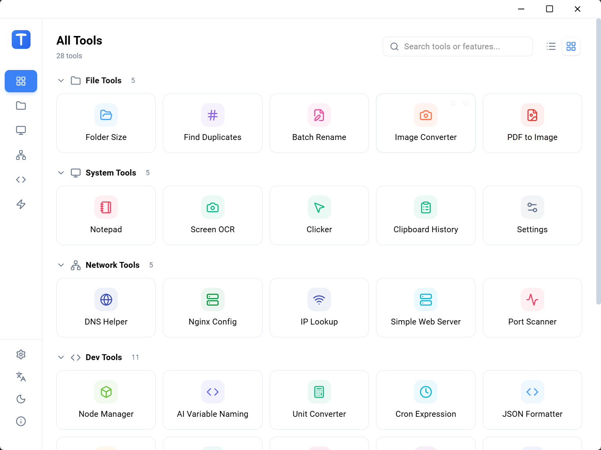
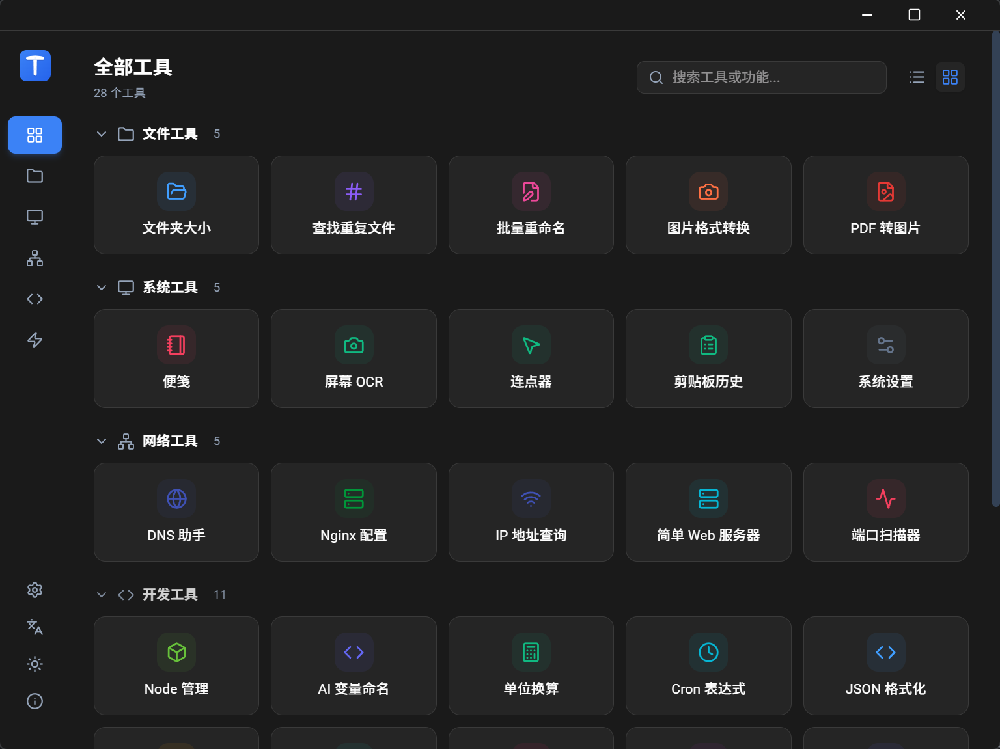
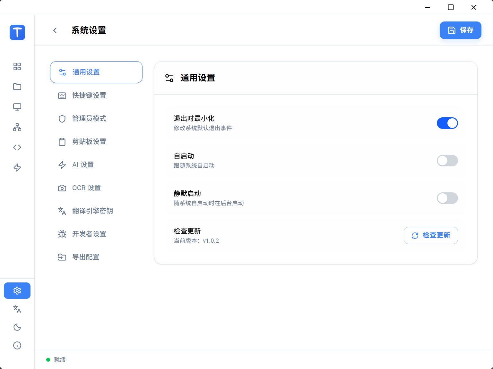
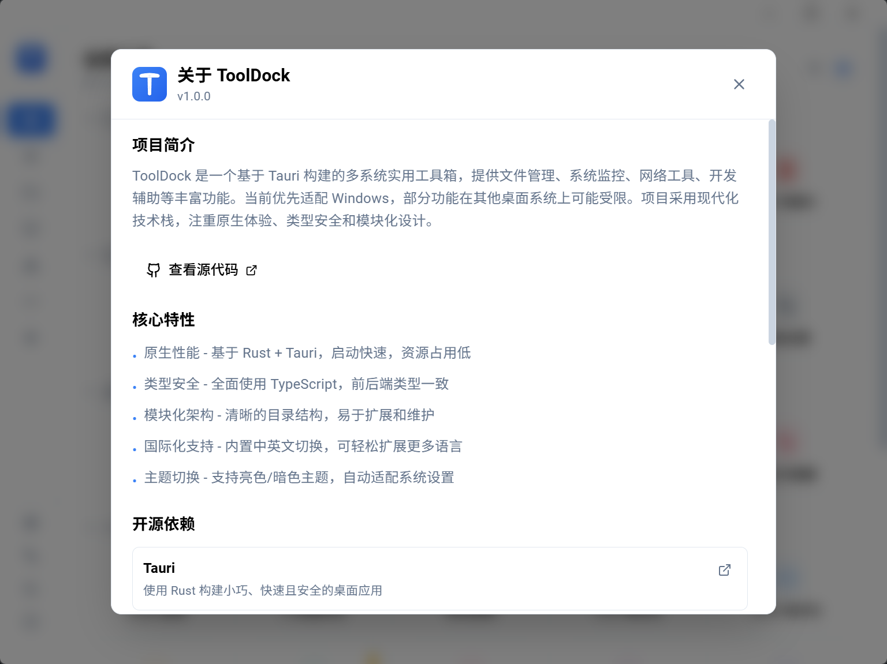

<div align="center">

# 🧰 ToolDock

**A cross-platform desktop toolbox for daily file, system, network, and developer utilities, with Windows as the primary supported platform today.**

Built with Tauri v2, React 19, TypeScript, Rust, MUI v7, and Vite.

[](LICENSE)
[](https://tauri.app)
[](https://react.dev)
[](https://www.typescriptlang.org)

[English](README.md) | [简体中文](README_zh.md)

</div>

---

## ✨ What Is ToolDock?

ToolDock is a native-feeling desktop utility app that collects common tools in one place. It is designed for quick access, local-first workflows, and small but useful tasks that usually require separate apps or command-line snippets.

The app is built on Tauri's cross-platform foundation. Windows is currently the main development and testing target, and some features depend on Windows APIs, but the project is not intentionally limited to Windows-only use.

The project uses a React frontend for the interface and a Tauri/Rust backend for desktop capabilities such as file access, local commands, clipboard features, OCR, and native packaging.

## 🖼️ Screenshots

### 🧩 Tool Overview



### 🌐 English Interface



### 🌙 Dark Theme



### ⚙️ Settings



### ℹ️ About Dialog



## ⭐ Highlights

- 28 utility tools plus a settings center, grouped by file, system, network, developer, and entertainment categories.
- Native desktop packaging through Tauri v2, with a small footprint compared with Electron-style apps.
- React 19 + MUI v7 interface with light/dark theme support.
- Rust command layer for filesystem, network, OCR, clipboard, conversion, and local automation tasks.
- Built-in Chinese and English localization.
- Central tool registry in `src/tools/registry.ts`, making tools easier to discover and extend.

## 📋 Requirements

| Component | Requirement |
| --- | --- |
| OS | Windows 10 / 11 currently tested first; other Tauri-supported desktop systems may need feature-specific adaptation |
| Node.js | 20 or newer |
| pnpm | Current stable version |
| Rust | Stable toolchain with the target for your current system |
| WebView2 | Required by Tauri on Windows |

## 🚀 Quick Start

Use PowerShell 7:

```powershell
git clone https://github.com/hugqq/ToolDock.git
cd ToolDock
pnpm install
pnpm tauri dev
```

## 🛠️ Common Commands

Use PowerShell 7:

```powershell
# Start Vite only
pnpm dev

# Start the full Tauri desktop app
pnpm tauri dev

# Build frontend assets
pnpm build

# Build desktop installers and bundles
pnpm tauri build
```

Build artifacts are generated under:

```text
src-tauri/target/release/bundle/
```

## 🧭 Tool List

### 📁 File Tools

- Folder Size: scan folders and analyze disk usage.
- Hash Calculator: calculate MD5, SHA1, SHA256, and related checksums.
- Batch Renamer: preview and apply batch rename rules.
- Image Converter: convert images between common formats and resize them.
- PDF to Image: render PDF pages as exportable images.

### 🖥️ System Tools

- Notepad: manage plans, memos, attachments, reminders, and Pomodoro sessions.
- Screen OCR: capture screen areas and recognize text.
- Clicker: automate mouse clicks, keyboard presses, and quick text input.
- Clipboard Manager: record and search clipboard history.
- Settings: manage app preferences, translator keys, AI settings, update checks, and import/export configuration.

### 🌐 Network Tools

- DNS Helper: run DNS queries and related diagnostics.
- Nginx Editor: edit, validate, template, and manage local Nginx configs.
- Port Scanner: scan open ports by common ports, ranges, or custom lists.
- IP Lookup: query IP location and network information.
- Simple Web Server: serve a local folder over HTTP for quick LAN sharing or static page testing.

### 💻 Developer Tools

- Node Cleaner: find and clean `node_modules` and package cache folders.
- AI Variable Naming: generate naming suggestions.
- Unit Converter: convert currency, length, weight, temperature, base, storage, and network speed units.
- Cron Generator: build and preview cron expressions.
- JSON Formatter: beautify, minify, validate, and inspect JSON.
- Encoder/Decoder: handle Base64, URL, Hex, HTML, Unicode, Binary, JWT, Punycode, and Morse formats.
- Translator: translate text with Google, DeepL, Baidu, Youdao, Tencent, and Volcengine providers.
- Color Picker: pick and convert colors.
- QR Code: generate QR codes and scan QR codes from images.
- Text Diff: compare text or file differences.
- Timestamp Converter: convert Unix timestamps and readable date/time values.

### 🎮 Entertainment

- 2048: classic number puzzle game with AI-assisted play.
- Othello: local AI and online multiplayer Othello.

## 🗂️ Project Structure

```text
ToolDock/
├── src/                    # React frontend
│   ├── api/                # Frontend API helpers
│   ├── components/         # Shared UI components and layouts
│   ├── hooks/              # Reusable React hooks
│   ├── i18n/               # Chinese and English locale files
│   ├── lib/                # Tauri wrappers and shared frontend helpers
│   ├── pages/              # Tool pages
│   ├── stores/             # Zustand stores
│   └── tools/              # Tool registry
├── src-tauri/              # Tauri and Rust backend
│   ├── capabilities/       # Tauri permission capability files
│   ├── scripts/            # Packaging scripts
│   └── src/
│       ├── commands/       # Tauri command entry points
│       ├── core/           # Core Rust logic
│       ├── models/         # Shared data models
│       └── errors.rs       # Shared error handling
├── scripts/                # Project helper scripts
├── tests/                  # Node-based tests
└── public/                 # Static assets
```

## ➕ Adding a Tool

The usual flow is:

1. Add the user-facing page under `src/pages/`.
2. Add or reuse shared UI in `src/components/`.
3. Add translations in `src/i18n/locales/en.json` and `src/i18n/locales/zh-CN.json`.
4. Register the tool in `src/tools/registry.ts`.
5. If native access is needed, add Rust logic under `src-tauri/src/core/` and expose it through `src-tauri/src/commands/`.
6. Update Tauri capabilities if the tool requires additional permissions.

## 🔎 Troubleshooting

Use PowerShell 7:

```powershell
# Clear local app data
Remove-Item -Path "$env:LOCALAPPDATA\tooldock" -Recurse -Force -ErrorAction SilentlyContinue

# Stop a running app process
taskkill /F /IM ToolDock.exe

# Clean Rust build artifacts
Push-Location src-tauri
cargo clean
Pop-Location

# Enable verbose Rust logs for the current shell
$env:RUST_LOG = "debug"
pnpm tauri dev
```

## 📦 Release

The release helper updates version numbers, creates a commit, creates or replaces the release tag, and pushes the branch and tag.

Use PowerShell 7 only when you are ready to publish:

```powershell
.\scripts\release.ps1 1.0.2
```

## 🤝 Contributing

Contributions are welcome. Please keep changes focused, include clear reproduction steps for bugs, and follow the existing frontend/Rust structure.

Suggested commit types:

- `feat`: new feature
- `fix`: bug fix
- `docs`: documentation
- `style`: formatting only
- `refactor`: internal restructuring
- `perf`: performance improvement
- `test`: tests
- `chore`: maintenance

## 📄 License

ToolDock is released under the [MIT License](LICENSE).
